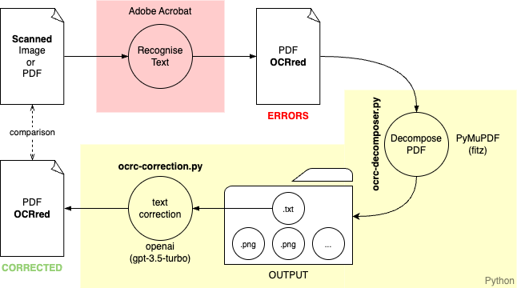

# OCRcorrection
Python code to extract text from an OCRred (OCR-processed) PDF and correct it.



## Instructions
### Requirments

 - Adobe Acrobat  
 - Python (Created with 3.12.5 version)
    - PyMuPDF 1.25.3
    - openai 1.61.1

You need an API Key from Openai

## Steps
1) **Create environment**
```
Conda create -n ocrcorrection-env
```
2) **Install libraries** with
```
pip install -r code/requirements.txt
```
or 
```
pip3 install -r code/requirements.txt
```
or just install the libraries
```
pip3 install openai
pip3 install pip install PyMuPDF
```
3) **Run the PDF decomposer**...
```
python3 ocrc-decomposer --pdf path/to/the/pdf.pdf --out path/output/folder
``` 
It will create a folder named path/output/folder with a output.txt file and a series of .png images
4) **Run the Text corrector**...
```
python3 ocr-correction --api openai-api-key --text path/to/the/txt.txt --out path/output/pdf.pdf --ln language (default: english)
```
